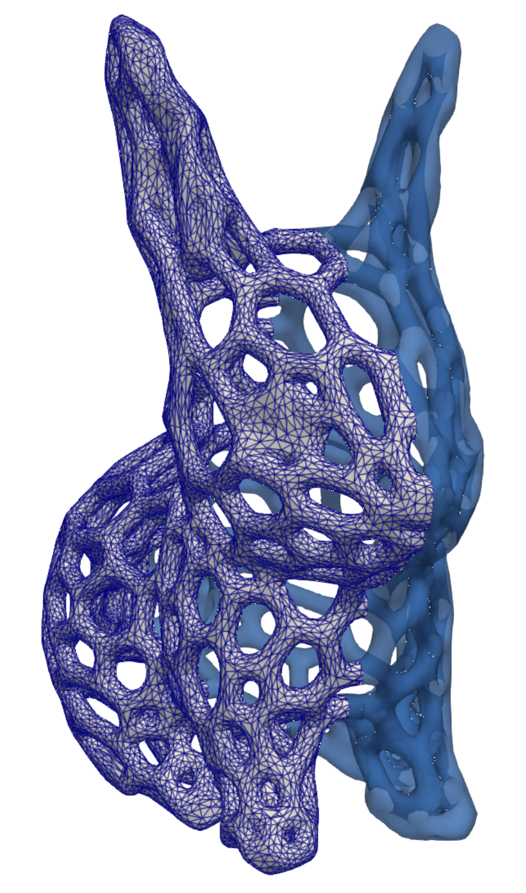

# stl2sdf.jl

A Julia package for converting STL triangular surface meshes to implicit geometries defined by Signed Distance Functions (SDFs). Provides simple SDF computation with raycasting-based sign detection, RBF smoothing, and artifact removal capabilities. For usage examples, see [`test/Examples/`](test/Examples/).

<p align="center">
  
</p>

## Features

- **STL Import**: Handles both ASCII and binary STL formats with automatic duplicate vertex removal
- **SDF Computation**: Exact distance calculation with KD-tree acceleration for spatial queries
- **Sign Detection**: Robust raycasting with adaptive sampling and BVH acceleration
- **Artifact Removal**: Connected components analysis to eliminate small disconnected regions
- **RBF Smoothing**: Radial Basis Function interpolation/approximation for geometry refinement
- **ParaView Export**: VTI format output with distance fields for visualization

## Installation

```julia
# From Julia REPL, press ] to enter package mode
pkg> add https://github.com/jezekon/stl2sdf.jl
```

or

```bash
git clone https://github.com/jezekon/stl2sdf.jl
```

## Main Function

Convert STL mesh to signed distance function:

```julia
stl_to_sdf(stl_filename::String; options::Options = Options())
```

#### Parameters

- `stl_filename::String`: Path to input STL file (ASCII or binary)
- `options::Options`: Configuration options (optional)

#### Return Value

- `Tuple`: Empty tuple (results saved to disk as VTI files)
- **Output files**:
  - `{name}_sdf.vti`: Original SDF on coarse grid (always generated)
  - `{name}_fine_sdf.vti`: Smoothed SDF on refined grid (only if smoothing enabled)

### Options

Configure the SDF generation with the following parameters:

```julia
options = Options(;
    smoothing_method = nothing,            # :interpolation, :approximation, or nothing (default: no smoothing)
    grid_refinement = 1,                   # Grid refinement factor (1 or 2)
    cell_size = nothing,                   # Grid cell size (nothing = interactive)
    remove_artifacts = false,              # Remove small disconnected components (default: false)
    artifact_ratio = 0.01                  # Min component size (fraction of largest)
)
```

#### Option Details

- **smoothing_method**: RBF smoothing approach
  - `nothing` - No smoothing (default)
  - `:interpolation` - Preserves exact SDF values at grid points
  - `:approximation` - Smoother results, may modify values
- **grid_refinement**: Output grid resolution multiplier (1 = same as input, 2 = double)
- **cell_size**: Explicit grid spacing (if `nothing`, prompts interactively based on mesh analysis)
- **remove_artifacts**: Enable connected components cleanup for noisy meshes
- **artifact_ratio**: Keep components ≥ this fraction of largest component size

### Example Usage

```julia
using stl2sdf

# Basic usage with interactive grid setup
stl_to_sdf("Data/Bunny.stl")
```

### Advanced Usage Examples

For complete examples, see [`test/Examples/`](test/Examples/):

#### Basic Example

```julia
# Simple beam with default settings
julia --project=. test/Examples/01_basic_beam.jl
```

#### Complex Example

```julia
# With smoothing and artifacts cleanup
julia --project=. test/Examples/02_complex_artifacts.jl
julia --project=. test/Examples/03_manual_sdf.jl
```

### Visualization in ParaView

1. Load the output VTI file in ParaView
2. Add **Contour** filter
3. Set **Isosurfaces** value to 0.0 to visualize the zero-level (surface)

For distance field visualization:

1. Select **Point Gaussian** to show signed distance values
2. Color by `distance` field
3. Adjust color scale if needed

---

## Acknowledgments

This package implements SDF generation for implicit geometry representation. Built on [MeshIO.jl](https://github.com/JuliaIO/MeshIO.jl) for mesh I/O, [ImplicitBVH.jl](https://github.com/StellaOrg/ImplicitBVH.jl) for ray tracing acceleration, and [NearestNeighbors.jl](https://github.com/KristofferC/NearestNeighbors.jl) for spatial queries.
