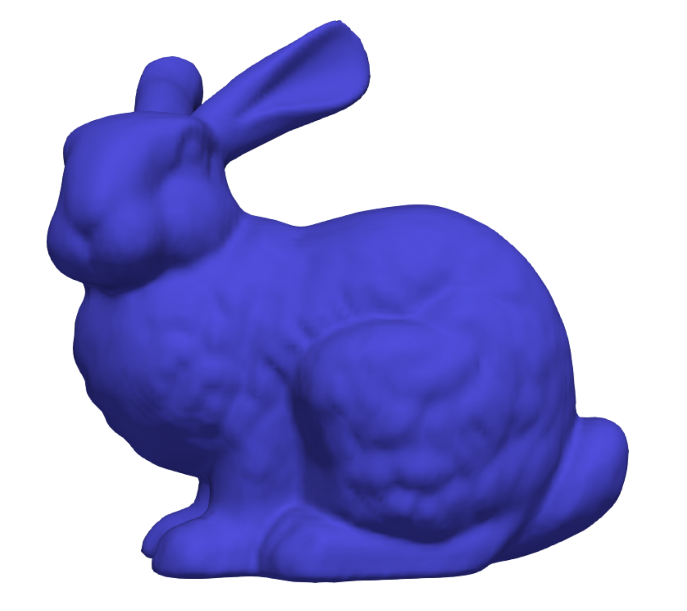

## stl2sdf

A Julia package for converting triangular surface meshes (STL files) to implicit geometries defined by Signed Distance Functions (SDFs). This package transforms explicit boundary representations into smooth volumetric implicit representations while preserving the original geometry's volume.

<p align="center">
  
  
</p>

## Overview

This package provides tools to:
1. Import STL files (both ASCII and binary formats)
2. Compute high-quality Signed Distance Functions
3. Apply RBF-based smoothing for improved SDF quality
4. Export results in various formats (VTI, JLD2) for visualization and further processing

The conversion process preserves the original volume of the geometry while creating a smooth, continuous implicit representation suitable for further analysis, simulation, or manufacturing.

## Installation

```julia
using Pkg
Pkg.add("https://github.com/jezekon/stl2sdf.jl")
```

## Dependencies

This package requires:
- Tetgen executable in your system PATH
- Julia packages: GeometryBasics, MeshIO, FileIO, LinearAlgebra, NearestNeighbors, KernelFunctions, IterativeSolvers, FastGaussQuadrature, JLD2, WriteVTK

## Main Function

```julia
stl_to_sdf(stl_filename::String; options::SDFOptions = SDFOptions())
```

### Parameters:
- `stl_filename::String`: Path to the input STL file
- `options::SDFOptions`: Configuration options (optional)

### Return Value:
- `Tuple`: (sdf_dists, sdf_grid, fine_sdf, fine_grid)
  - `sdf_dists`: Original SDF values on coarse grid
  - `sdf_grid`: Original grid structure
  - `fine_sdf`: Smoothed SDF values on fine grid
  - `fine_grid`: Fine grid structure for the smoothed SDF
- Files are also saved to disk (.vti, .jld2) for visualization and later use

## SDFOptions

The `SDFOptions` struct allows for customization of the SDF generation process:

```julia
SDFOptions(;
    smoothing_method::Symbol = :interpolation,  # Smoothing method: :interpolation or :approximation
    grid_refinement::Int = 1,                   # Grid refinement factor (1 or 2)
    grid_step::Union{Float64, Nothing} = nothing # Custom grid step size (or auto if nothing)
)
```

### Options:

#### smoothing_method::Symbol
- Method used for SDF smoothing
- Valid values:
  - `:interpolation`: Preserves original SDF values at grid points
  - `:approximation`: May modify values for smoother results

#### grid_refinement::Int
- Factor by which to refine the grid for the smoothed SDF
- Valid values: 1 (same as original) or 2 (twice the resolution)

#### grid_step::Union{Float64, Nothing}
- Explicit grid step size for SDF computation
- If `nothing`, an interactive prompt will help determine an appropriate size
- Use this for automated processing or batch jobs

## Example Usage

```julia
# Basic usage with default options
result = stl_to_sdf("models/bracket.stl")

# Custom options
options = SDFOptions(
    smoothing_method = :approximation,
    grid_refinement = 2,
    grid_step = 0.5
)
result = stl_to_sdf("models/bracket.stl", options=options)

# Access and use the results
sdf_dists, sdf_grid, fine_sdf, fine_grid = result

# The function also saves files:
# - bracket_sdf.vti       (Original SDF visualization)
# - bracket_sdf.jld2      (Original SDF data)
# - Z_bracket_FineSDF_... (Smoothed SDF data)
# - Z_bracket_FineGrid... (Smoothed grid data)
```

## Workflow

The package follows this processing pipeline:

1. Import STL mesh using optimized algorithms
2. Run Tetgen to generate a volumetric tetrahedral mesh
3. Create computational grids based on mesh dimensions
4. Compute unsigned distances from grid points to triangular surface mesh
5. Determine sign (inside/outside) using tetrahedral mesh
6. Combine to create raw SDF
7. Apply RBF smoothing for high-quality SDF
8. Export results to VTI format for visualization in ParaView

## Visualization

Results can be visualized in ParaView using the exported VTI files. The SDF is stored as a scalar field, and the zero-isosurface represents the boundary of the object.

## TODO List
- [ ] Implement more efficient KD-tree for large meshes
- [ ] Include additional mesh repair operations
